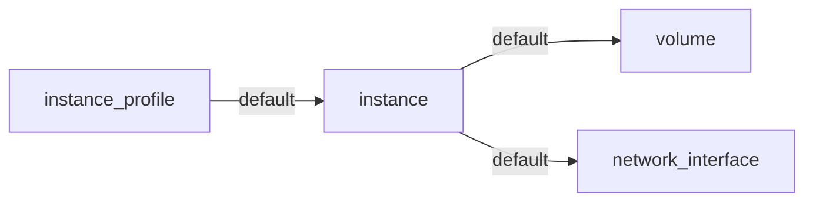
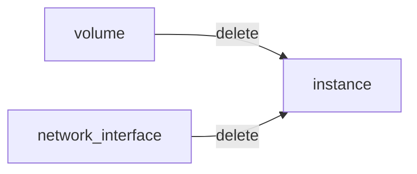

# Search traversals

`<--` traverses the inventory graph inbound, while `-->` traverses the graph outbound.


## Outbound

`-->` traverses the graph outbound to the next level.

:::tip[Example]

```bash title="Select AWS accounts and traverse the graph outbound"
is(aws_account) -->
```

This query would return a list of all matching regions.


:::

## Inbound

`<--` traverses the graph inbound to the next level.

:::tip[Example]

```bash title="Select AWS EC2 instances, traverse the graph inbound, and filter to only return the aws_regions"
is(aws_ec2_instance) <-- is(aws_region)
```


:::

## Including the current node

`-[0:1]->` traverses the graph outbound, starting from the current node **(0)** until the next level **(1)**. The result will contain the current node plus all nodes one level outbound. The same applies for inbound with this statement `<-[0:1]-`.

:::tip[Example]

```bash title="Return all resources "under" an aws_region together with the matching aws_region"
is(aws_region) -[0:1]->`
```


:::

:::tip[Example]

```bash title="Return all aws_regions with name global, together with all accounts"
is(aws_region) and name==global <-[0:1]-
```

:::

## By depth

### Range

`-[start:until]->` traverses the graph outbound starting from a user defined depth to a user defined depth. The graph will be traversed from the current node according to this specification. All matching nodes will be returned. The same applies for inbound traversals with `<-[start:until]-`.


:::tip[Example]

The following query answers the question, "Which instance profile is used for ec2 instances connected to an alb target group?"

```bash title="Select aws_alb_target_groups, traverse 2 levels inbound, and filter for aws_iam_instance_profiles"
is(aws_alb_target_groups) <-[2:2]- is(aws_iam_instance_profile)
```

:::

### One-sided range

`-[start:]->` traverses the graph outbound starting from a user defined depth to the leafs of the graph. The graph will be traversed from the current node according to this specification. All matching nodes will be returned. The same applies for inbound traversals with `<-[start:]-`.

:::tip[Example]

```bash
is(aws_account) and name==sunshine -[0:]->
```

This query will select the aws account with name `sunshine` and then select all nodes outbound to this node. This will select everything Fix Security knows about nodes in this account.

:::

### Bi-directional

`<-[start:until]->` traverses the graph inbound and outbound starting from a user defined depth to a user defined depth. The graph will be traversed from the current node according to this specification. All matching nodes will be returned.

:::tip[Example]

```bash title="Select nodes with the name sunset connected on any depth to the AWS account"
name="sunset" and is(aws_account) <-[0:]->
```

:::

## By edge type

Every [edge](../inventory-graph/index.mdx#edges) has a type which defines the relationship between two [nodes](../inventory-graph/index.mdx#nodes).

The types of edge can be specified via the graph traversal: `-<edge_type>[<start>:<until>]->`. If more than one type should be used for the traversal, the types need to be separated by comma.

Fix Security currently supports two types of edges.

### Default edges

Default edges are assumed if no specific edge type is defined or requested. This usually means the "logical" dependency between two resources.



A volume or network interface might be attached to a volume. The dependency between the 2 is expressed as default edge. Every resource in Fix Security is connected via an edge of type default.

### Delete edges

If a resource has dependencies of type `delete`, then this resource can not be deleted right away. All transitive dependencies need to be deleted first, while the order is also defined in the graph. You can see the blast radius of a delete operation by following all transitive dependencies.



:::tip[Examples]

```bash title="Selects all instances, walk the default edge outbound, and filter on volumes; returns volumes that are attached to an instance"
is(instance) -default-> is(volume)
```

```bash title="Blast radius of resources that are affected when volume foo would be deleted"
is(volume) and name == foo -delete[1:]->
```

```bash title="Select all volumes and traverse one step using default/delete dependency; returns all resources that are found"
is(volume) and name==foo -default,delete->
```

:::

There is special syntax if you want to traverse the graph in both directions using different edge types for every direction:

```bash title="Pick one volume, then traverse delete dependencies both inbound and outbound"
is(volume) limit 1 <-delete[1:1]->
```

```bash title="Pick one volume, then traverse inbound using delete dependencies and outbound using both delete and default dependencies"
is(volume) limit 1 <-delete[1:1]default,delete->
```

## Abbreviations

There are abbreviations for commonly used traversal selectors:

| Abbreviated Selector | Unabbreviated Selector |
| -------------------- | ---------------------- |
| `-->`                | `-[1:1]->`             |
| `<--`                | `<-[1:1]-`             |
| `<-->`               | `<-[1:1]->`            |
| `<-[x]-`             | `<-[x:x]-`             |

:::tip[Examples]

| Abbreviated                     | Unabbreviated                     |
| ------------------------------- | --------------------------------- |
| `search is(aws_account) -->`    | `search is(aws_account) -[1:1]->` |
| `search is(aws_region) <-->`    | `search is(aws_region) <-[1:1]->` |
| `<-[x]-`                        | `<-[x:x]-`                        |
| `search is(aws_region) <-[3]->` | `search is(aws_region) <-[3:3]->` |

:::
